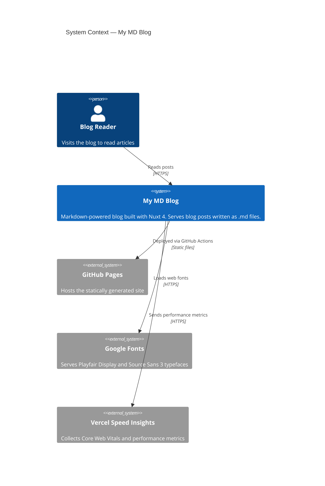
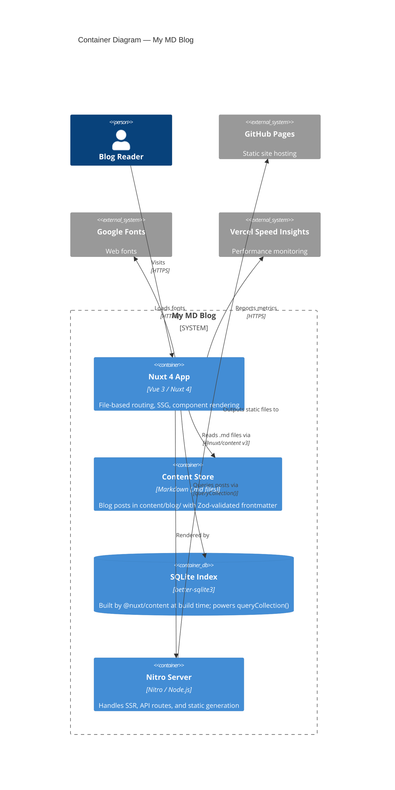
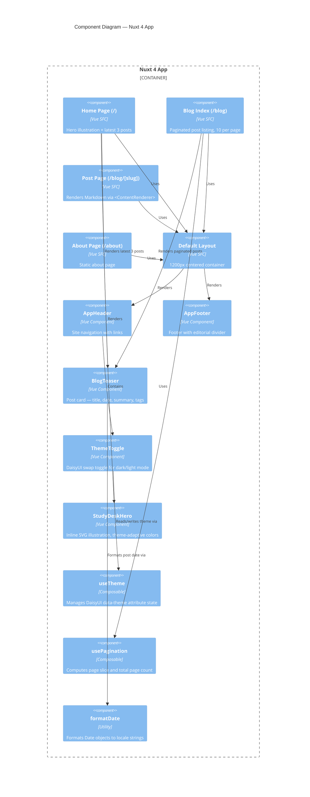

# C4 Architecture Diagrams — My MD Blog

---

## Level 1 — System Context

```mermaid
C4Context
  title System Context — My MD Blog

  Person(reader, "Blog Reader", "Visits the blog to read articles")

  System(blog, "My MD Blog", "Markdown-powered blog built with Nuxt 4. Serves blog posts written as .md files.")

  System_Ext(github_pages, "GitHub Pages", "Hosts the statically generated site")
  System_Ext(google_fonts, "Google Fonts", "Serves Playfair Display and Source Sans 3 typefaces")
  System_Ext(vercel_insights, "Vercel Speed Insights", "Collects Core Web Vitals and performance metrics")

  Rel(reader, blog, "Reads posts", "HTTPS")
  Rel(blog, github_pages, "Deployed via GitHub Actions", "Static files")
  Rel(blog, google_fonts, "Loads web fonts", "HTTPS")
  Rel(blog, vercel_insights, "Sends performance metrics", "HTTPS")
```

---

## Level 2 — Containers

```mermaid
C4Container
  title Container Diagram — My MD Blog

  Person(reader, "Blog Reader")

  System_Boundary(blog, "My MD Blog") {
    Container(nuxt_app, "Nuxt 4 App", "Vue 3 / Nuxt 4", "File-based routing, SSG, component rendering")
    Container(content_store, "Content Store", "Markdown (.md files)", "Blog posts in content/blog/ with Zod-validated frontmatter")
    ContainerDb(sqlite_db, "SQLite Index", "better-sqlite3", "Built by @nuxt/content at build time; powers queryCollection()")
    Container(nitro, "Nitro Server", "Nitro / Node.js", "Handles SSR, API routes, and static generation")
  }

  System_Ext(github_pages, "GitHub Pages", "Static site hosting")
  System_Ext(google_fonts, "Google Fonts", "Web fonts")
  System_Ext(vercel_insights, "Vercel Speed Insights", "Performance monitoring")

  Rel(reader, nuxt_app, "Visits", "HTTPS")
  Rel(nuxt_app, content_store, "Reads .md files via", "@nuxt/content v3")
  Rel(nuxt_app, sqlite_db, "Queries posts via", "queryCollection()")
  Rel(nuxt_app, nitro, "Rendered by")
  Rel(nitro, github_pages, "Outputs static files to")
  Rel(nuxt_app, google_fonts, "Loads fonts", "HTTPS")
  Rel(nuxt_app, vercel_insights, "Reports metrics", "HTTPS")
```

---

## Level 3 — Components (Nuxt 4 App)

```mermaid
C4Component
  title Component Diagram — Nuxt 4 App

  Container_Boundary(nuxt_app, "Nuxt 4 App") {

    Component(page_home, "Home Page (/)", "Vue SFC", "Hero illustration + latest 3 posts")
    Component(page_blog, "Blog Index (/blog)", "Vue SFC", "Paginated post listing, 10 per page")
    Component(page_post, "Post Page (/blog/[slug])", "Vue SFC", "Renders Markdown via <ContentRenderer>")
    Component(page_about, "About Page (/about)", "Vue SFC", "Static about page")

    Component(layout_default, "Default Layout", "Vue SFC", "1200px centered container")
    Component(app_header, "AppHeader", "Vue Component", "Site navigation with links")
    Component(app_footer, "AppFooter", "Vue Component", "Footer with editorial divider")
    Component(blog_teaser, "BlogTeaser", "Vue Component", "Post card — title, date, summary, tags")
    Component(theme_toggle, "ThemeToggle", "Vue Component", "DaisyUI swap toggle for dark/light mode")
    Component(hero, "StudyDeskHero", "Vue Component", "Inline SVG illustration, theme-adaptive colors")

    Component(use_theme, "useTheme", "Composable", "Manages DaisyUI data-theme attribute state")
    Component(use_pagination, "usePagination", "Composable", "Computes page slice and total page count")
    Component(format_date, "formatDate", "Utility", "Formats Date objects to locale strings")
  }

  Rel(page_home, layout_default, "Uses")
  Rel(page_blog, layout_default, "Uses")
  Rel(page_post, layout_default, "Uses")
  Rel(page_about, layout_default, "Uses")

  Rel(layout_default, app_header, "Renders")
  Rel(layout_default, app_footer, "Renders")
  Rel(app_header, theme_toggle, "Contains")
  Rel(theme_toggle, use_theme, "Reads/writes theme via")

  Rel(page_home, hero, "Renders")
  Rel(page_home, blog_teaser, "Renders latest 3 posts")
  Rel(page_blog, blog_teaser, "Renders paginated posts")
  Rel(page_blog, use_pagination, "Uses")

  Rel(blog_teaser, format_date, "Formats post date via")
```
